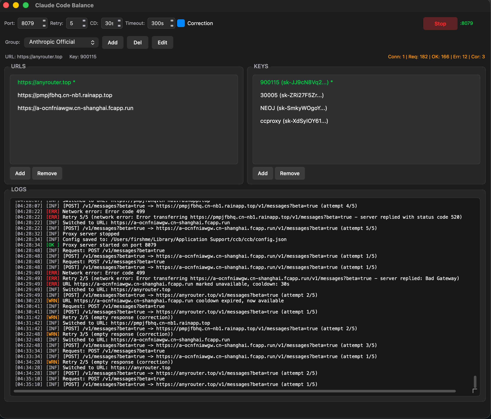

## ClaudeCodeBalance (自动构建Windows&macos)


### 右侧Release进行下载自动打包好的内容即可。

* 不会断线，保证你的ClaudeCode一直在工作，可以手动切换 Group 不会影响使用，无感知。

> 自己去手动申请license即可，程序完全离线激活。


* settings ` ~/.claude/settings.json`

```json
{
  "env": {
    "ANTHROPIC_BASE_URL": "http://127.0.0.1:8079",
    "ANTHROPIC_AUTH_TOKEN": "sk-",
    "ANTHROPIC_MODEL": "claude-opus-4-5-20251101",
    "ANTHROPIC_SMALL_FAST_MODEL": "claude-sonnet-4-5-20250929",
    "ANTHROPIC_DEFAULT_SONNET_MODEL": "claude-sonnet-4-5-20250929",
    "ANTHROPIC_DEFAULT_HAIKU_MODEL": "claude-sonnet-4-5-20250929",
    "DISABLE_NON_ESSENTIAL_MODEL_CALLS": "1",
    "CLAUDE_CODE_DISABLE_NONESSENTIAL_TRAFFIC": "1"
  },
  "enabledPlugins": {
    "context7@claude-plugins-official": true
  }
}

```

* license 自己申请即可。

```bash

https://license.wwwneo.com/

```



