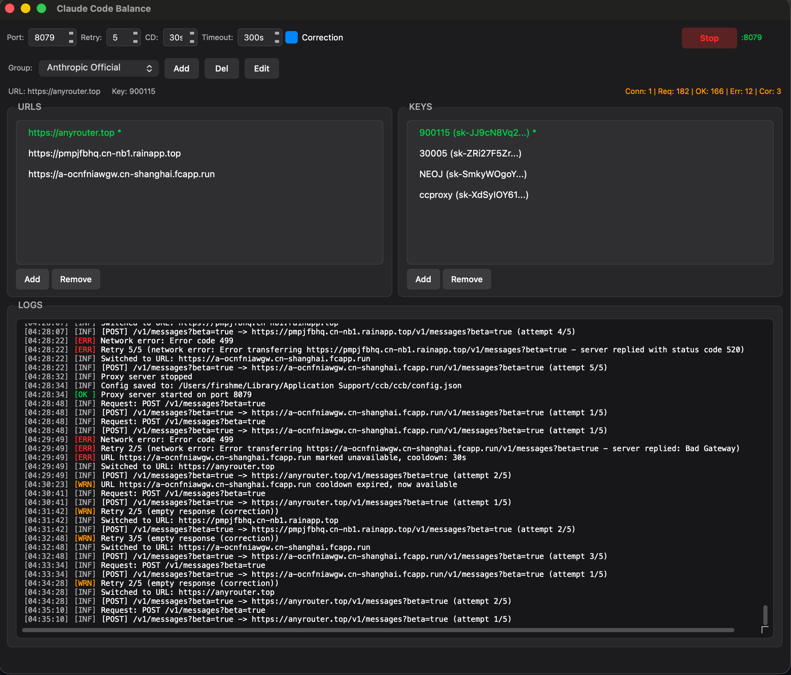

## ClaudeCodeBalance (自动构建Windows&macos)


### 右侧Release进行下载自动打包好的内容即可。

* 不会断线，保证你的ClaudeCode一直在工作，可以手动切换 Group 不会影响使用，无感知。

> 自己去手动申请license即可，程序完全离线激活。


* settings ` ~/.claude/settings.json`

```json
{
  "env": {
    "ANTHROPIC_BASE_URL": "http://127.0.0.1:8079",
    "ANTHROPIC_AUTH_TOKEN": "sk-",
    "DISABLE_NON_ESSENTIAL_MODEL_CALLS": "1",
    "CLAUDE_CODE_DISABLE_NONESSENTIAL_TRAFFIC": "1",
    "CLAUDE_CODE_DISABLE_EXPERIMENTAL_BETAS": "1",
    "CLAUDE_CODE_ATTRIBUTION_HEADER": "0",
    "DISABLE_AUTOUPDATER": "1",
    "CLAUDE_CODE_MAX_OUTPUT_TOKENS": "640000",
    "CLAUDE_CODE_DISABLE_AUTO_MEMORY": "1",
    "DISABLE_INSTALLATION_CHECKS": "1",
    "ENABLE_EXRERIMENTAL_MCP_CLI": "true",
    "CLAUDE_CODE_EXPERIMENTAL_AGENT_TEAMS": "1",
    "API_TIMEOUT_MS": "1200000",
    "ENABLE_LSP_TOOLS": "true",
    "MCP_TOOL_TIMEOUT": "4500000"
  },
  "permissions": {
    "defaultMode": "plan"
  },
  "model": "opus[1m]",
  "fastMode": true,
  "skipDangerousModePermissionPrompt": true,
  "teammateMode": "in-process",
  "agentSettings": {
    "teammateModel": "sonnet"
  }
}
```

* license 自己申请即可。

```bash

https://license.wwwneo.com/

```



